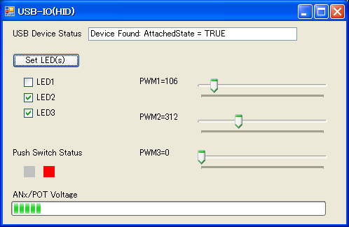
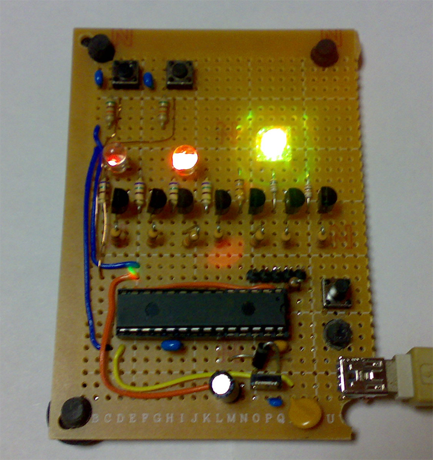

<meta http-equiv="Content-Type" content="text/html; charset=utf-8">
# Pic24UsbIo

PIC24FJ64GB002を使ってUSB経由でLEDの制御、スイッチの読み取りを行う 
PICには２個のプッシュスイッチ入力、１個のA/D入力、４個のＬＥＤ出力、１個のＲＧＢ－ＬＥＤ（３個のＰＷＭ出力）を用意 
<a href="http://www.microchip.com/ja/mplab/microchip-libraries-for-applications" target="_blank" >
マイクロチップ社で公開されているMLA</a>の\apps\usb\device\hid_customを流用 

開発環境 
PIC側 
MPLAB X IDE v3.35 + XC16(v1.23) + PICKit3 
Windows側 
Microsoft Visual C# 2010 Express 
 
 

Windowsアプリケーション・スクリーンショット 
 

試作基板 
 

